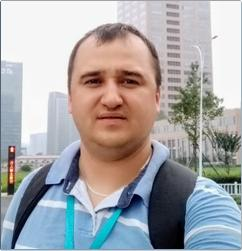

# Vitali Kulsha
## Junior Java Developer
|||
|---|---|
||Location: Belarus, Zhodino E-mail: kulsha_85@mail.ru Phone: +375 29 567 86 01 Discord: Vitali(@vitalikulsha) GitHub: [vitalikulsha](https://github.com/vitalikulsha) LinkedIn: [vitali-kulsha](www.linkedin.com/in/vitali-kulsha)|

## About me

I work as a leading process engineer. Extensive experience in design and 3D modeling (KOMPAS, SolidWorks, Inventor, ProEngineer). I am developing in JAVA development. Completed the Java Basics Upskill online course at EPAM, as well as various webinars, marathons and free courses.

## Skills

### Hard skills

||||
|:----:|:----:|:---:|
|Java SE/EE|Spring|Git|
|MVC|REST|Hibernate|
|JDBC|JSP|Servlet|
|Maven|JUnit|SQL|
|HTML|CSS|JS|
|Intellij IDEA|VS Code| Postman|

### Soft skills

||||
|:----:|:----:|:---:|
|Sociability|Responsibility|Quick learning|
|Tenacity|Organization|Initiative|

## Projects

[**REST API Application**](https://github.com/vitalikulsha/UpSkill_Lab1_JavaBasics/tree/master/WebBasicsREST)

**«Library»** app using Spring Boot and REST API with ability to change authors and categories.

[**Java web project using servlets and JSP**](https://github.com/vitalikulsha/JavaWebProject)

**"Library"** system with the ability to search and order books.

[**Console Application**](https://github.com/vitalikulsha/user-catalog)

Console application for creating/editing/viewing users and saving to a file. Without the use of third-party libraries and frameworks.

[**Telegram bot**](https://github.com/vitalikulsha/BLRweAreOne_bot)

Telegram-bot in the form of a quiz using Spring Boot

## Work experience

Extensive experience in machine-building production as a design engineer, CNC machine tool programmer, process engineer. I just started my journey in programming. Completed a basic Java programming course at the EPAM online laboratory. Here is a repository with educational projects. There are also a large number of educational projects on GitLub, but they are in private status, for educational purposes.

## Education
**BNTU | MEF**

_«Tool production technology»_

Higher education | 09.2005 - 06.2011

### Courses

|Organizer|Date|Projects or certificates|
|----|:----:|----|
|EPAM, online|11/20-03/21|[Course "Java Basics"](https://github.com/vitalikulsha/BasicOfOOP)|
|EPAM, online|03/21-05/22|[Course "Java Basics Upskill Lab"](https://github.com/vitalikulsha/UpSkill_Lab1_JavaBasics)|
|ITVDN, online   Course "Java Developer"|07/21-09/21|[Java Starter](https://testprovider.com/ru/search-certificate/tp69745306) [Java EE Basics](https://testprovider.com/ru/search-certificate/tp35933273) [JDBC & Hibernate](https://testprovider.com/ru/search-certificate/tp28332316) [Git Basics](https://testprovider.com/ru/search-certificate/tp72998692) [Spring](https://testprovider.com/ru/search-certificate/tp59390149) [Spring Data](https://testprovider.com/ru/search-certificate/tp11562388)|
|Stepik, online|05/22 - u.n.|[SQL](https://stepik.org/cert/1503804) [WEB technologies](https://stepik.org/cert/151220) [Java web service part 1](https://stepik.org/cert/1520251) [Java web service part 2](https://stepik.org/cert/1522773) [JavaScript](https://stepik.org/cert/1535024)|
|ITEA, online|09/21-09/21|[Course "HTML-marathon"](https://github.com/vitalikulsha/vitalikulsha.github.io)|

## Foreign languages

English — Elementary (Beginner)

